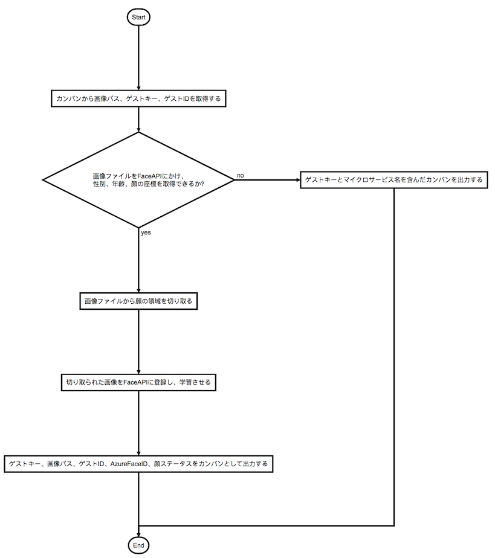

# azure-face-api-registrator-kube   
## 概要  
1枚の画像を Azure Face API(Detect) にかけ、返り値として、画像に映っているすべての人物の顔の位置座標、性別・年齢等の情報を取得します。   
Azure Face API の仕様により、顔の位置座標を形成する長方形の面積が最も広い顔が先頭に来ます。    
この仕様を利用して、その先頭の顔の 位置座標、性別・年齢 等の 情報 を保持します。  
次に、この位置座標を使って、その位置座標の通り、当該画像を切り取ります。  
続いて、Azure Face API(Person Group _ Person - Create) に1つのレコードを登録します。  
そして、Azure Face API(Person Group _ Person - Add Face) に当該切り取られた画像を入力して、当該レコードに画像を更新します。        
最後に、Azure Face API の AI が認識できるようにするために、Azure Face API(Train) を実行します。        
参考：Azure Face API の Person Group は、Azure Face API ユーザ のインスタンス毎に独立した顔情報の維持管理の単位です。    

## 前提条件    
Azure Face API サービス に アクセスキー、エンドポイント、Person Group を登録します。  
登録されたエンドポイント、アクセスキー、Person Group を、本リポジトリ内の face-api-config.json に記載してください。  

## Requirements  
```
azure-cognitiveservices-vision-face==0.4.1
pillow
```
## I/O
#### Input-1
入力データ1のJSONフォーマットは、inputs/sample.json にある通り、次の様式です。  
```
{
    "output_data_path": "/var/lib/aion/Data/direct-next-service_1",
    "guest_id": 1,
    "face_image_path": "/var/lib/aion/Data/direct-next-service_1/1634173065679.jpg"
}
```
1. 入力データのファイルパス(output_data_path)    
前工程のマイクロサービスから渡されたJSONメッセージファイルのパス          
2. 顧客ID(guest_id)      
(エッジ)アプリケーションの顧客ID       
3. 顔画像のパス(face_image_path)        
入力顔画像のパス  

#### Input-2
入力データ2として、Azure Face API(Detect)への入力は、Azure FaceClient を用いて、主として main.py の次のソースコードにより行われます。  
本レポジトリの main.py の例では、画像に映っているすべての人物の顔の位置座標(X軸/Y軸)に加えて、性別と年齢のみを、Azure Face API から取得するという記述になっています。  

```
    def getFaceAttributes(self, imagePath):
        params = ['gender', 'age']
        # return self.face_client.person_group_person.get(PERSON_GROUP_ID, personId)
        with open(imagePath, 'rb') as image_data:
            return self.face_client.face.detect_with_stream(
                image_data, return_face_attributes=params
            )
```
#### Input-3
入力データ3として、Azure Face API(Persisted Faces - Post)への入力は、Azure FaceClient を用いて、主として main.py の次のソースコードにより行われます。  

```
    def setPersonImage(self, personId, imagePath, targetFace=None):
        logger.debug('Set person image ' + imagePath)
        with open(imagePath, 'r+b') as image:
            self.face_client.person_group_person.add_face_from_stream(
                PERSON_GROUP_ID, personId, image, targetFace)
```            
#### Input-4
入力データ4として、Azure Face API(Train)への入力は、Azure FaceClient を用いて、主として main.py の次のソースコードにより行われます。  
```
    def train(self):
        # Train the person group
        self.face_client.person_group.train(PERSON_GROUP_ID)

        logger.debug('Training the person group...')
        while True:
            training_status = self.face_client.person_group.get_training_status(PERSON_GROUP_ID)
            logging.info('Training status: {}.'.format(training_status.status))
            if (training_status.status is TrainingStatusType.succeeded):
                break
            elif (training_status.status is TrainingStatusType.failed):
                logger.error('Failed to train ...')
                raise Exception('Training the person group has failed.')
            time.sleep(1)
```

#### Output-1  
出力データ1のJSONフォーマットは、outputs/face-api-detect-response-sample.json にある通り、次の様式です。（一部抜粋）  
```
{
    "faceId": "c5c24a82-6845-4031-9d5d-978df9175426",
    "recognitionModel": "recognition_01",
    "faceRectangle": {
      "width": 78,
      "height": 78,
      "left": 394,
      "top": 54
    },
    "faceAttributes": {
      "age": 71,
      "gender": "male",
    },
}
```

#### Output-2  
出力データ2のJSONフォーマットは、outputs/sample.json にある通り、次の様式です。  
```
{
    "result": true,
    "filepath": "/var/lib/aion/Data/direct-next-service_1/634173065679.jpg",
    "guest_id": 1,
    "face_id_azure": "xxxxxxxx-xxxx-xxxx-xxxx-xxxxxxxxxxxx",
    "attributes": {
        "gender": "male",
        "age": "37.0"
    }
}
```
1. ゲストID(guest_id)    
(エッジ)アプリケーションの顧客ID        
2. 顔画像ファイルのパス(filepath)      
顔画像ファイルのパス      
3. AzureFaceID(face_id_azure)      
AzureFaceAPIのFaceID    
4. 顔画像の属性情報      
AzureFaceAPIの返り値としての性別・年齢情報  


## Getting Started  
1. 下記コマンドでDockerイメージを作成します。  
```
make docker-build
```
2. aion-service-definitions/services.ymlに設定を記載し、AionCore経由でKubernetesコンテナを起動します。  
services.ymlへの記載例：  
get_one_kanbanのメソッドで動作するので、Jobとして起動します。  
```
  azure-face-api-registrator-kube:
    always: no
    multiple: yes
```
## Flowchart
